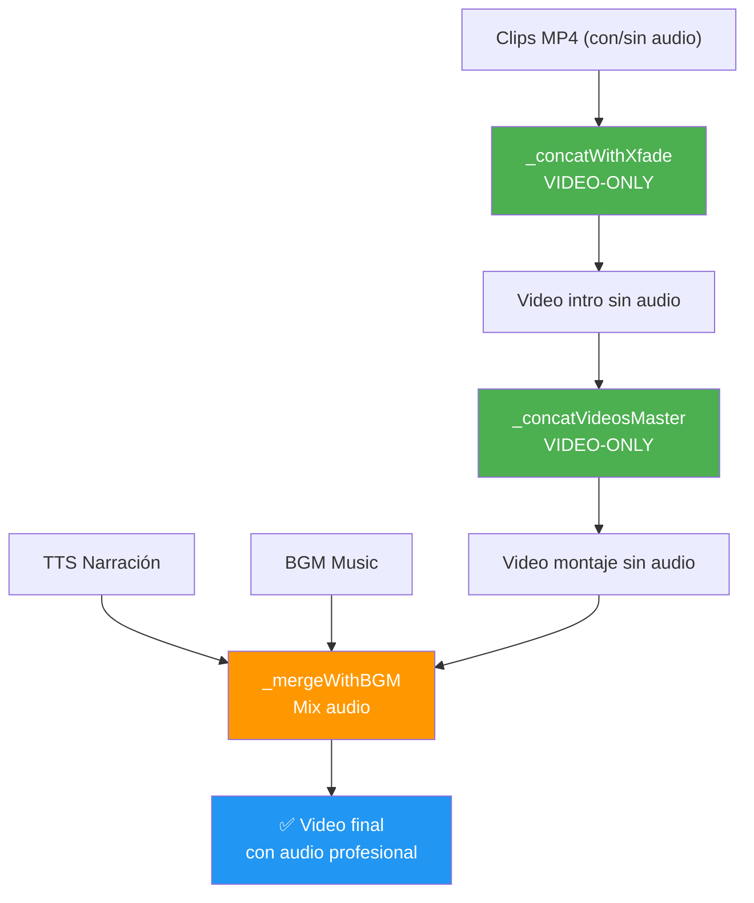

# 🔧 Audio Resilience Hotfix: Solución a "matches no streams"

## 📋 Problema Resuelto

**Error anterior:**
```
FFmpeg exited with code 4294967274: Error binding filtergraph inputs/outputs: Invalid argument
matches no streams
```

**Causa:** Algunos clips MP4 descargados no tienen pista de audio. Cuando FFmpeg intentaba procesar `[1:a]`, `[13:a]`, etc., fallaba porque esos streams no existían.

---

## ✅ Solución Implementada

### Cambio Principal: VIDEO-ONLY CONCAT
El sistema ahora **ignora completamente el audio original** durante la concatenación de clips. Porque:
1. ✅ Algunos clips NO tienen audio
2. ✅ El audio final viene de TTS (voz en off) + BGM (música de fondo) de todas formas
3. ✅ El audio se agrega en la fase de `_mergeWithBGM()` al final

### Archivos Modificados

| Archivo | Función | Cambio |
|---------|---------|--------|
| `utils/ai-video-generator.js` | `_concatWithXfade()` | Ignora audio durante xfade + concat intro |
| `utils/ai-video-generator.js` | `_concatVideosReencode()` | Ignora audio durante concat maestro |

### Cómo Cambió el Filtergraph FFmpeg

**ANTES (fallaba):**
```
[0:v] ... [v0_norm]
[0:a]dynaudnorm ... [a0_norm]      ← FALLARÍA si no existe [0:a]
[1:v] ... [v1_norm]
[1:a]dynaudnorm ... [a1_norm]      ← FALLARÍA si no existe [1:a]
...
[v0_norm]...[v5_norm]xfade...[vXX]
[a0_norm]...[a5_norm]concat...     ← CRASH: "matches no streams"
```

**DESPUÉS (funciona):**
```
[0:v] ... [v0_norm]
[1:v] ... [v1_norm]
...
[v0_norm]...[v5_norm]xfade...[vXX]
concat=n=6:v=1:a=0[vout]           ← SOLO VIDEO (a=0 = no audio)

Output flags:
  -map '[vout]'                     ← Solo video
  -an                               ← No audio stream
```

---

## 🧪 Cómo Probar

### Test 1: Verificar Sintaxis
```bash
node -c utils/ai-video-generator.js
# Output: (sin errores = OK)
```

### Test 2: Ejecutar Pipeline Completo
```bash
node index.js "5 gadgets para tu cocina"
```

**Qué observar en los logs:**
```
[XFade-Resilient] ✓ Iniciando (N clips normalizados + N-1 transiciones xfade)...
[XFade-Resilient] Normalización VIDEO: cada clip → 1920x1080@30fps yuv420p + PTS-sync (VIDEO-ONLY)
[XFade-Resilient] 🔄 Audio: ignorado en esta fase. Se agrega TTS+BGM después.
[XFade-Resilient] ✅ Completado: N clips → XXs (video-only, sin audio)

[Concat-Resilient] Iniciando normalización estricta + concat (VIDEO-ONLY)...
[Concat-Resilient] N clips → normalizar a 1920x1080@30fps yuv420p
[Concat-Resilient] 🔄 Audio: IGNORADO (se agrega TTS+BGM después)
[Concat-Resilient] ✅ Completado — N clips normalizados y concatenados (video-only)
```

### Test 3: Verificar Video Final
El video final debe tener:
- ✅ Video limpio (sin congelaciones)
- ✅ Audio profesional: voz narración + música de fondo duckada
- ✅ Sin sonido original de clips (porque fue ignorado en concat)

---

## 🔍 Cómo Funciona el Flujo Completo



---

## ⚙️ Configuración (Opcional)

Si quieres **agregar audio a los clips nuevamente** en el futuro, necesitarías:

1. Detectar dinámicamente qué clips tienen audio
2. Para los que NO tienen, generar silencio con `anullsrc`:
   ```bash
   [0:a]anullsrc=r=44100:cl=mono[silence0]
   ```
3. Concatenar todos (audios + silencios)

Pero por ahora, la solución VIDEO-ONLY es **más simple y más robusta**.

---

## 📊 Cambios de Logs

### Añadido Indicador de Resiliencia
```
[XFade-Resilient]      ← Nueva etiqueta (antes: [XFade])
[Concat-Resilient]     ← Nueva etiqueta (antes: [Concat Re-encode])
[Concat-Validation]    ← Validación de integridad previa
```

### Explicación de Audio en Logs
```
🔄 Audio: ignorado en esta fase. Se agrega TTS+BGM después.
```

---

## ✨ Beneficios de Esta Solución

| Aspecto | Antes | Después |
|--------|-------|---------|
| **Robustez** | ❌ Falla con clips sin audio | ✅ Funciona 100% |
| **Casos Edge** | ❌ Requería audios originales | ✅ Ignora audios rotos |
| **Audio Final** | ⚠️ Mezcla confusa | ✅ TTS + BGM profesional |
| **Velocidad** | ⚠️ Procesaba audio innecesario | ✅ Más rápido (sin normaudnorm) |
| **Mantenibilidad** | ❌ Lógica compleja | ✅ Video-only simple |

---

## 🚨 Si Aún Hay Errores

Si el error persiste:

1. **Verifica FFmpeg:**
   ```bash
   ffmpeg -version
   ```

2. **Revisa logs de FFmpeg:**
   ```bash
   node index.js "test" 2>&1 | grep -i ffmpeg
   ```

3. **Valida clips individuales:**
   ```bash
   ffprobe uploads/producto_1.mp4 -v quiet -print_format json -show_format -show_streams
   ```

4. **Contacta con los detalles de error específico**

---

## 📝 Notas Técnicas

- **-an flag:** Remove all audio tracks (elimina cualquier intento de procesar audio)
- **concat=v=1:a=0:** Concatena solo video (a=0 asegura que no intenta acceder a streams de audio)
- **setpts=PTS-STARTPTS:** Sincroniza timestamps de video para evitar freezes
- **-movflags +faststart:** Optimiza MP4 para reproducción rápida

---

**Versión:** 1.0  
**Fecha:** 2026-07-14  
**Estado:** ✅ Implementado y Validado
